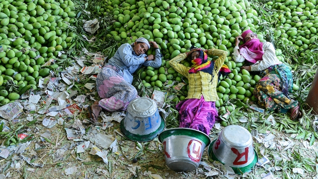
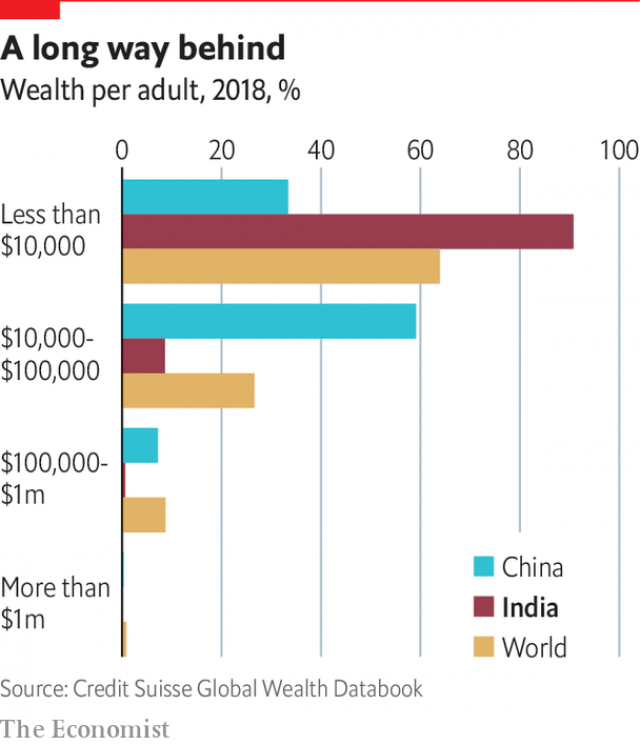
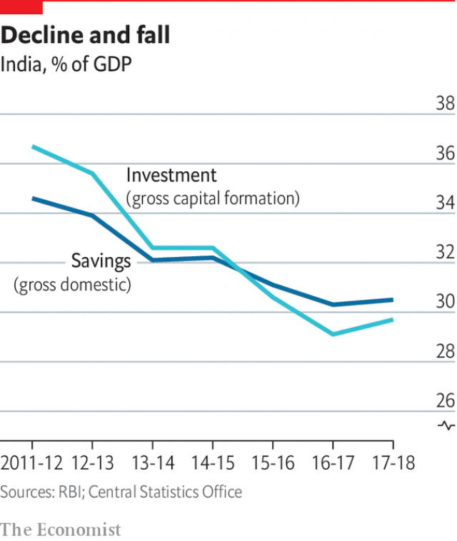

###### Economy

# A downturn in India reveals the desperate need for deeper reform 

 

> print-edition iconPrint edition | Special report | Oct 26th 2019 

WITHIN A FEW years, Indian planners hope that bullet trains will reduce the time taken for the 500km (310 miles) journey between Mumbai, the commercial capital, and Ahmedabad, the biggest city in Mr Modi’s home state of Gujarat, from six hours to just two. For now, laws that protect tiny properties are holding up the railway’s construction. Two years after breaking ground, the Japanese-financed project has not yet managed to acquire even half the land it needs. By contrast, China added another 4,000km of track for its nationwide high-speed network in 2018 alone. 

Historians reckon that the two Asian giants have had roughly equal economies for much of their history. Only since the 1990s, when China began its daring, deep-seated economic reforms, has it raced ahead. Its nominal GDP is now five times India’s. The dragon has slowed its pace, but even so, notes a report by Rakesh Mohan, a Yale professor and former deputy governor of the Reserve Bank of India (RBI), the country’s central bank, it is still adding the equivalent of a quarter of India’s economy every year. If India were to sustain its GDP growth per person of 7%—about its average for the past two decades—to 2030, it would barely have got to where China is today. And even that may prove ambitious. 

Now, with alarming speed, India has gone from being the world’s fastest-growing large economy to something more like a rumbling Indian railway train. In the quarter to June, growth slipped to 5%, the slowest in six years. Other indicators are more worrying still. Sales of trucks and buses fell 45% in the year to September, and even sales of cheap biscuits and soap have contracted. The 88% drop in overall credit flows to businesses in the two quarters to September compared with the same period last year suggests a virtual freeze on lending. 

Believing its own boosterism, the government failed to see the signs. Yet even as the slowdown became more pronounced, Mr Modi still managed to get himself re-elected in May with a huge majority. The first budget of his second term, announced in July by the incoming finance minister, Nirmala Sitharaman, signalled business as usual. The emphasis was on new taxes, more handouts, more regulations, a further bail-out of public-sector banks and the airy goal of doubling India’s GDP to $5trn within five years. As the summer wore on, however, it became clearer that the economy had turned against Mr Modi, even if the electorate had not. The big question now is whether the downturn will be bad enough to force the prime minister into some of the much-needed reforms that he avoided in his first term. Some changes have started to be made in the past few months. 

Initial tweaks in August had little effect, but on September 20th the government abruptly decreed a sharp cut in corporate tax, from an effective rate of 35% to a far more competitive 25%. The move prompted Mumbai’s biggest stockmarket leap in a decade. The market’s instant, oversized joy suggests two things. One is that there is a great deal of pent-up energy in the Indian economy, waiting to be released by wiser government policies. The other is that if Mr Modi’s government puts in some effort, it is capable of coming up with those wiser policies. Businesses are watching to see what will follow. There are rumours of a sweeping privatisation drive. But it is unclear whether Mr Modi’s reforming side can override his conservatism, which reflexively favours an interventionist state, protectionist trade policies and the opinions of Hindutva trade unions, small business lobbies and ideologues. 

These tensions played out during Mr Modi’s first term, which saw the introduction of some welcome reforms. A long-overdue bankruptcy law theoretically reduced the time to settle a business failure from around four years to nine months. The GST did, for all its paperwork, abolish absurd interstate duties and so sped up internal commerce. Fiscal discipline kept inflation modest. Infrastructure—and in particular power supplies—improved substantially. Over the past decade 30m more Indians every year have been connected to the electric grid, which now reaches 90% of all homes. India climbed a stunning 65 places up the World Bank’s Ease of Doing Business Index and pulled in record hauls of foreign investment, totalling more than $35bn in each of the past three years. 

Yet the government shied away repeatedly from risking its political capital on deeper structural reforms. Labour laws that make hiring and firing too expensive remained a block to growth, as did laws making it hard for companies to acquire land. Such blockages continue to hamstring efforts to expand India’s manufacturing base, Chinese-style, to create plentiful low-paid factory jobs for rural migrants. Instead of supporting small business, the government experimented with shock demonetisation, fancy new taxes and heavier enforcement. Rather than promoting trade, it scrapped existing bilateral deals, raised tariffs and sparred with the WTO. Disappointing his own business constituency, Mr Modi dodged calls to privatise some banks, industries and utilities, instead forcing healthy state-owned firms to swallow sick ones. 

 

At the same time, regulators moved too slowly to deal with an urgent problem. Driven by starry forecasts and cronyism under the previous government, state-owned banks had let non-performing loans inflate to a $200bn balloon. Then, caught in the glare of increased scrutiny, they reined in lending, further crimping investment and pushing credit-seekers towards non-banking financial corporations (NBFCs). In October 2018 a default by one of those caused hiccups across the financial sector. Despite $30bn in government bail-outs for state banks, and a slow decline in non-performing assets, lenders and borrowers remain wary. 

Though foreign direct investment stayed strong in Mr Modi’s first term, all but a trickle of the new money poured into services and a few big acquisitions, rather than job- or export-generating industry. The largest single deal saw Walmart, an American retail giant, splash out $16bn for control of Flipkart, an online retailer. The ink had scarcely dried on Walmart’s cheque before the government radically changed the e-commerce rules that had underpinned Walmart’s decision to invest. Small traders, who are an important part of the influential Hindutva business lobby, had pressed the government for changes, revealing the kind of obstacles that reforms have to overcome. 

All the while, talk of Indian growth obscured such facts as declining farmgate prices, stagnant urban wages, flat exports, rising household debt, a long-term decline in savings and investment rates, and flat or falling consumer spending. 

Some of India’s top economists did notice the gloomy numbers and realised that since the country’s statistics agency changed its methodology in 2011, there had been growing divergences between calculations of GDP and a range of other indicators. The doubters, who include Arvind Subramanian, the government’s chief economic adviser from 2014 to 2018, do not suggest foul play but rather poor methodology, compounded by the difficulty of measuring an “informal” sector that makes up 45% of the economy and accounts for 75% of employment. If the critics are right, growth since 2011 may have been overstated by 2-2.5% a year. As Mr Subramanian notes, the trouble with bungling the numbers is that it is like driving with a faulty speedometer. Indeed, the strongest proof that growth was overstated may be that India appears to have driven off course. The current slump can largely be ascribed to policies followed in the mistaken belief that India was hurtling along at 7-8% annual growth, when the reality was more like 5-6%. 

Since the slowdown has taken hold, Ms Sitharaman has scrapped the most onerous of new taxes and compliance rules. She also announced the government would support NBFCs, and top up a range of schemes meant to ease access to export credits and housing loans. Amid a series of rate cuts by the RBI, the government also imposed a slew of mergers between state-owned banks that will, in theory, improve their books and make them keener to lend. The sudden move to slash company taxes came with a further sweetener, a two-year window for new industrial investments to attract a rate of just 17%. 

Businesses have broadly welcomed all these moves, as well as having their tax cut by a third, but concerns persist. Though the supply-side tinkering helps, it does not indicate personal attention from Mr Modi, let alone the kind of policy shift many feel is needed to kick-start growth. “The lack of economic vision baffles me,” says a conservative think-tank scholar who now regrets voting for Mr Modi. “They get this monster electoral verdict, and then do nothing?” 

 

Turning ten stodgy state banks into four bigger ones, for instance, may indeed strengthen the financial sector in the long term. More immediately, though, it ties up the institutions just when the economy needs them. The government promises to buy itself more cars, and to lower interest rates on housing for public servants, but neglects stronger demand-side prods such as rural public works. Ms Sitharaman talks of tweaking export credits and speeding tax reimbursements for exporters, when letting the overvalued rupee drop would boost exports even more. She has chastised tax officers for being overly aggressive, but aside from the cut in corporate rates that simply brings India closer to world averages, has proposed no other bold tax relief. 

This is badly needed. India has some of the world’s most convoluted taxes, and enforces them with gusto. GST paperwork is tricky. Rates for some goods are ruinously high. Cement and cars are taxed at 28% (plus hefty further taxes for cars), which is odd if you wish to save manufacturing jobs or spur housing investment. Some personal stories are hair-raising. One luxury-goods executive complains that inspectors invaded his home at gunpoint in the middle of the night and held him and his wife hostage for two days, threatening jail for not co-operating as they poked through his cupboards. They found nothing, but left the businessman shaken. He has decided to leave the country. 

Despite the gouging, the government is faced with a chronic deficit. It pretends this is a mere 3.4%, but after allowing for hidden off-budget liabilities and state debts, overall government borrowing is closer to 9%. August brought a reprieve, with a hefty and controversial dividend payment from the central bank to shore up revenue. But those off-budget fudges, demands from states and shrinking tax receipts will soon start to squeeze the exchequer. 

The gloom is not universal. The $180bn IT sector, centred on boomtowns like Bengaluru (formerly Bangalore) and Hyderabad, continues to prosper. NASSCOM, an industry body, counted 7,200 start-ups in 2018, of which eight became “unicorns”, valued at over $1bn. Tata Consulting Services passed another milestone for Indian IT firms, reaching a market capital of $100bn. The sector cannot pull the rest of India along, however, and has its own limits. NASSCOM predicts that automation is likely to shrink the number of IT jobs—currently more than 4m—by some 14% in the next five years. 

Population growth, rising productivity and growing aspirations can probably propel a big, diversified economy at a steady 5%. Barring a global crisis, even without ambitious new policies, India may be able to climb out of the current doldrums. Returning to the trajectory of 7-8% growth would take a little longer. 

With luck, in a few years’ time, the present slump may be regarded as a useful catalysing moment, like the economic crisis of 1991 that sparked India’s initial market reforms. But bringing back the brash, risk-taking ebullience of the mid-2000s will not be easy. Many believed Mr Modi when he promised achhe din—good times—in 2014. Starting his second term with a deep slump, he has no one to blame but himself. Worse, say critics, he has no one to turn to. Ms Sitharaman is tough and straight, but her team does not inspire confidence. “We always had bad institutions, but a few really talented people—ninjas who could go in and make things work,” says a former finance-ministry mandarin. “Now it’s a Trumpian wasteland.”■ 

