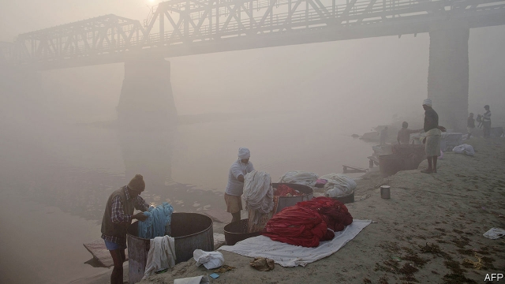
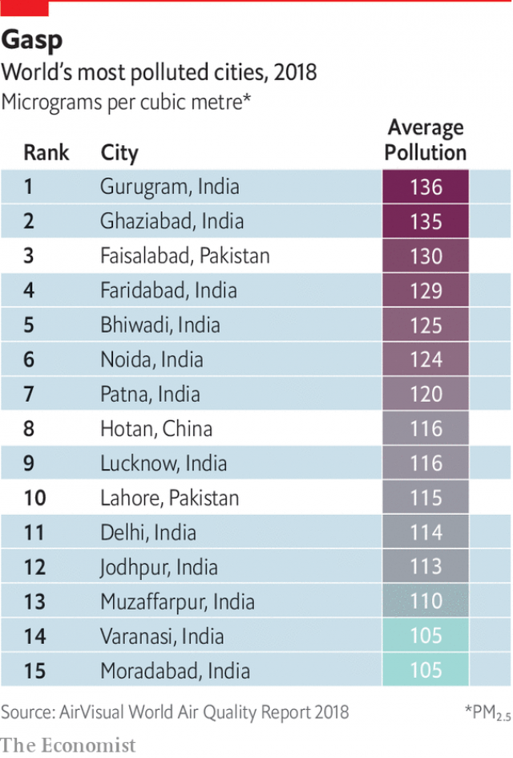

###### Three challenges

# Environmental, educational and administrative gridlock threaten India’s future 

 

> print-edition iconPrint edition | Special report | Oct 26th 2019 

INDIA’S INFRASTRUCTURE is creaking, its health-care system even more so. Poverty and inequality remain omnipresent, and now the economy is struggling. Narendra Modi’s to-do list is long. But there are three issues that, if dealt with, could bring about big improvements. The environment is one. Twelve of the world’s 15 most polluted cities are in India (see chart), and the country ranks 120th of 122 on the global index of water quality. A second is education. As more people move to cities for the first time, it is crucial that they are trained to find jobs in India’s 21st-century economy. A third issue is administration. With its basic structures unchanged since the British Raj, India’s government is undermanned, unevenly deployed and badly equipped to cope. 

Take the environment first. A visitor from the past would scarcely recognise the plains of Punjab and Haryana in northern India. Vast irrigation works, mechanised farming and hybrid seeds have greened the horizons, turning once-hungry India into a big exporter of grain. But now a visitor may not even be able to see the plains. Every year farmers setting fire to rice stubble create a dense seasonal smog. This mixes with diesel exhaust, smoke from coal-fired power stations and other noxious gases to form a toxic cocktail engulfing the whole north Indian plain from Lahore in Pakistan to Dhaka in Bangladesh, where some 800m people live. The bad air may cause as many as 1.2m premature deaths a year, and shave four years off the average lifespan. 

Some of this comes from changing agricultural techniques. Mechanical harvesters leave the rice stubble longer, so it cannot be ploughed in and must be burned. “What do you expect us to do?” shrugs a turbaned farmer near Karnal, a rural town 100km north of Delhi. But much of India’s air pollution is simply the price of progress. Western countries went through it and their democratic process forced them to change. China is passing through it, too, but its one-party state can wield a big stick at polluters. India is stuck in between, with a democracy that is not robust enough to force environmental-policy change. 

 

On paper, India has strong laws and institutions for protecting the environment, including a powerful National Green Tribunal, which helps bolster enforcement. Mr Modi’s government has taken some big steps, adopting stricter vehicle-emissions standards, and achieving some ambitious solar-power targets. It is spending $150m on public messaging and new equipment to dissuade farmers from burning their fields, and has closed down some urban coal-fired power stations. Indians are not victims of deliberate policies but of a systemic failure to account for, and deal with, the uglier side-effects of progress. At the climate-change talks that led to the Paris agreement, Indian diplomats argued for, and won, relatively lenient commitments, having pleaded that it was unfair to be punished for following the same path as developed economies. 

India promised, for instance, that solar power will make up an impressive-sounding 36% of its generation capacity by 2030. Yet the government itself predicts that it will still account for just 23% of actual generation as opposed to capacity. Coal’s share is expected to fall from 74% to 50% of the mix, but since the total amount of power generated will grow, that still means adding more coal-burning power plants. These suck up precious fresh water and spew out greenhouse gases. Whereas the growth in carbon-dioxide output has slowed or fallen in much of the world, including China, in India it has doubled since 2005. 

Two-thirds of Indians still live in rural areas, compared with 41% of Chinese 

As for water, a near-total reliance on moody monsoons has not made Indians careful users. Around 70% of surface water is thought to be polluted, and pumping from 20m tube wells has dangerously lowered groundwater levels. Indian farmers use more groundwater than America and China combined. They draw as much as 6,000 litres of water to produce a kilo of rice, compared with as little as 600 in China. This is because for 50 years Indian governments have subsidised farming. Water for irrigation is free, and seeds, diesel fuel, electricity and fertiliser are all sold below cost. As a result, India now has a 70m tonne grain mountain and a 15m tonne sugar mountain. It ranks as the world’s biggest exporter of virtual water, shipping out the equivalent of nearly 100bn cubic metres a year in its exports of rice, textiles and other goods. 

Lack of access to clean water kills an estimated 200,000 Indians a year, and sickens millions more. Once-pleasant rivers such as the Yamuna in Delhi and the Mithi in Mumbai are devoid of oxygen and black with sewage. Bengaluru’s suburban lakes now regularly burst into flames or erupt in towers of toxic foam. Between pollution, overuse and global warming—which appears to be making the monsoons more capricious and slightly less generous—India is fast approaching a water crisis. 

Yet shifts in policy have been slow and piecemeal. Governments have preferred big, showy dams and canals to investing in urban sewage networks or enforcing rules on effluents. Many of the impressive 100m toilets built in Mr Modi’s first term stand idle for lack of water. His government now plans a nationwide programme to bring piped water to every home—a transformational move if it can pull it off. Yet, wary of rural voters, it has shied away from fixing an appropriate pricing structure to reflect the rising value of water. 

Only when it does is there likely to be the sort of decisive shift towards cities that China has recently undergone. Two-thirds of Indians still live in rural areas, compared with 41% of Chinese. One of the main reasons for lower urbanisation is that subsidies to farmers make small rural holdings sustainable. More than drought or flood or government neglect, the resulting lack of profitability is the real root of India’s rural distress. 

As more Indians become city-dwellers, one thing they need is better education. Although some states—Kerala being the champion—are approaching universal literacy, others trail far behind. And though the official claim of 75% literacy sounds respectable, more detailed studies raise doubts. The most recent report by ASER, an NGO that has undertaken annual surveys of rural schools since 2005, reveals rising attendance, an overall improvement in school facilities and an encouraging, albeit small, recent rise in learning levels. Even so, barely half of fifth-grade students nationwide had reached second-grade reading level, and less than a third were able to do basic maths. Among students completing eighth grade, some 27% could still not read at second-grade level, up from 15% ten years ago. 

Such results suggest not just that India’s 1.5m schools are generally bad, but that many children fail to develop important skills and yet still move up to the next level. The trouble is not limited to rural elementary schools. Aspiring Minds, a recruitment firm that tests millions of tech-industry applicants every year, reckons in its latest report that only 1.5% of India’s engineering graduates possess adequate skills to work in data-driven fields. More disturbing, this “employability ratio” has not improved since the company’s first survey in 2010. 

It is easy to ascribe such poor outcomes to low government spending on education. For decades, this has lingered below 4% of India’s GDP, far below the world average. A disproportionate share of that, too, has gone to higher education, to ensure that India has a trained elite to run the country. As a result, many of India’s top state universities are indeed globally competitive. The downside is that its ordinary state schools are not. 

Karthik Muralidharan and Abhijeet Singh, two economists, say the solution is not just to spend more money, but to change the culture and structure of Indian education. Schools are so geared to passing exams that they fail to impart skills or values. Teachers have limited time or motivation to teach slower students. 

Yamini Aiyar of the Centre for Policy Research, a Delhi think-tank, suggests the trouble starts higher up, in the educational establishment. The whole system, she argues, is designed and incentivised around enrolment and infrastructure rather than learning. The focus on measurement may reflect the scale of the challenge of managing so many schools in such diverse conditions. But add to this an 18% rate of absenteeism among teachers and it is not surprising the system is struggling. 

To the relief of education experts who have long pleaded for reform, Mr Modi’s government is considering a draft national educational policy that admits to a crisis. Its chief recommendation is for a massive focus on literacy and numeracy at the foundation stage, so that children stop falling behind. That would be a good start. 

A third challenge facing Mr Modi is one that plagues every Indian government: its tools are not up to the task. Almost uniquely among large developing countries, India does not have a bloated administration. Its bureaucracy is underweight and overstretched. In the words of Milan Vaishnav of Carnegie, a think-tank, “India is a 21st-century economic and diplomatic entity powered by a 19th-century state.” 

The vaunted “steel core” of government, the elite Indian Administrative Service, is made up of just 5,000 active officers, the same number, in proportion to the population, as when this correspondent’s great-grandfather joined it in 1889. That is some 1,500 officers short of the services’s full strength, made worse by politicians’ habit of shunting them from post to post. Similar levels of understaffing, as well as the “transfer Raj” of frequent repostings, and mismatches between skills and duties, plague every other Indian service, from the courts to schools to the police. 

The result is not just poor service. As many as 37% of high-court and 25% of district-court positions remain unfilled, which helps explain why Indian justice carries a backlog of more than 30m cases. If the most congested courts worked as efficiently as the least congested, one study found, India’s overall productivity would rise by 5%, an annual gain to GDP of some $150bn. Considering that India spends a miserly 0.12% of GDP on justice, hiring enough judges to sit in courts would seem a useful investment. 

If government is too flimsy, it is also the wrong shape, thin at the central and local levels but fat at the state level. Big cities, in particular, have neither the independence nor the political clout to cope with rapid urbanisation, let alone to plan for the future. “It is ironic that India, which is constitutionally federal, is less devolved than China,” says an urban-studies researcher. 

Mumbai, the richest and most populous city, is run by the same unelected bureaucrats who manage the surrounding state of Maharashtra, similar in size and population to Vietnam or Germany. The 22m Mumbaikars are at last getting a metro system. Until now, public transport consisted of a rumbling state-run bus service and a Raj-era suburban railway, managed from distant Delhi, that is so crowded and precarious it kills some 3,000 commuters a year. 

Freeing Indian cities to run their own affairs would cost very little but substantially boost the quality of life for millions of people. The reason it does not happen is political. In states like Maharashtra, party bosses like to milk urban areas to pay for vote-buying rural schemes. They also prefer big infrastructure to more mundane measures like making streets tidier or safer. If India is to thrive, the cities where the majority of Indians will soon be living need to be much better run. ■ 

