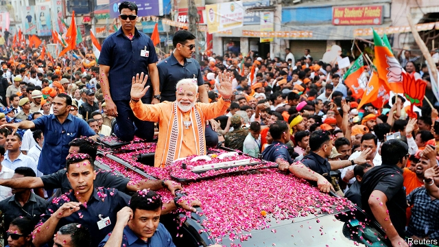
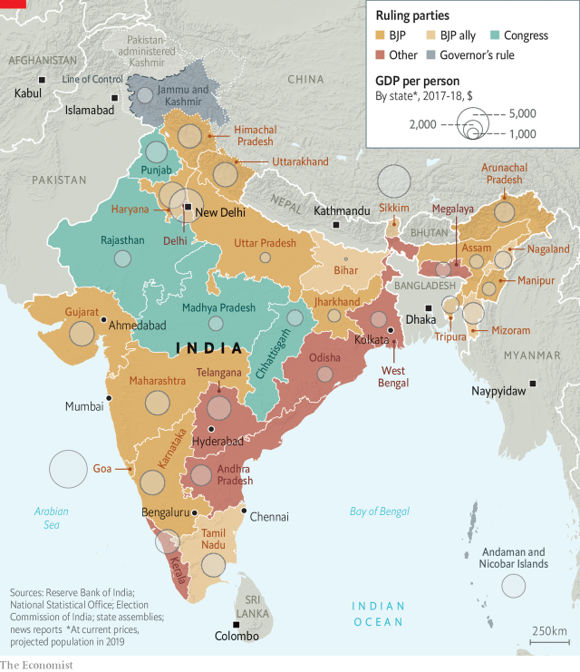
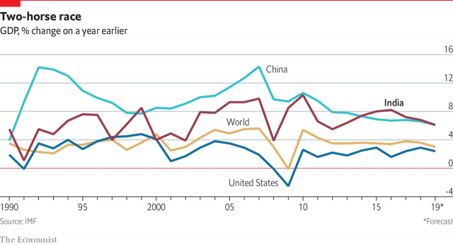

###### India

# India is stumbling because of its prime minister’s failure to curb his darker side 

 

> print-edition iconPrint edition | Special report | Oct 24th 2019 

TO ROARS OF approval from the pumped-up crowd packing a stadium in Houston, Texas, India’s prime minister gave his answer to the local greeting. “You ask, ‘Howdy, Modi?’, so I say, ‘Everything is fine in India!’” The prime minister repeated the phrase in half a dozen Indian languages, drawing more roars from different parts of the crowd. Narendra Modi is a master at turning such shows to his advantage. For more than 4m Indian-Americans, he had subtly equated his own person with the Old Country. And, by persuading President Donald Trump to appear on stage with him, he was showing a resurgent India, respected by world leaders and walking tall on the world stage. 

The son of a Gujarati grocer and a devout Hindu nationalist, the most powerful prime minister in a generation projects a comforting small-town conservatism. Yet his natty dress, uplifting talk of progress and cutting wit speak of upward mobility. Mr Modi’s stilted English may be awkward, but his aura of confidence declares the arrival of a bolder, stronger country. 

As on the world stage, so at home. When the results of India’s election were announced in May, Mr Modi’s Bharatiya Janata Party (BJP) surprised even its own supporters with the scale of its re-election success. The party had more money, more energy and a sharper message than its feeble, divided opponents. But mainly the outcome was a personal triumph for Mr Modi. Pundits now assert that after decades of wobbly coalition governments, India has entered a phase of hegemonic politics reminiscent of the 1950s and 1960s, when the Congress party held unchallenged power. The BJP’s current majority means it could push through almost any legislation Mr Modi wants. But for all his massive mandate, can he hold India together in all its contradictions and move it forward? 

Judging by his first term, and his government’s trajectory in the early months of his second, the answer is not at all clear. A great deal of hype accompanied Mr Modi’s arrival on the national scene in 2014. He was praised as a can-do, pro-business pragmatist who would wipe clean and shape up a government widely seen as venal and rotten. Yet Mr Modi’s first five years proved in many ways a wasted opportunity. With some notable exceptions, such as the introduction of a nationwide goods and services tax (GST) and a huge effort to stop “open defecation” by building more toilets, bold reforms were largely postponed in favour of policy tinkering, sops to noisy constituencies and packing the bureaucracy with loyalists. In his latest term, Mr Modi has seemed more intent on following another side of his character, consolidating personal control, punishing political foes and pursuing Hindu-nationalist ideological goals—such as placing 7.5m unhappy Muslims in Kashmir under extended lockdown and direct rule from Delhi—than dealing with more pressing economic issues. 

Mr Modi’s government has failed to acknowledge looming dangers to India’s economy and is now struggling to cope with an alarmingly sharp slowdown. In the first half of 2019 new banking credit to businesses crashed by a shocking 88%, and growth fell from 8% in 2018 to just 5% this year. For a large and diverse economy, this remains a respectable figure. But demographic pressures mean that India must sustain growth of 7.5% just to keep unemployment in check—and needs to do even better if it hopes ever to catch up with China. “Anything less than 6% feels like a recession in India,” says Pranjul Bhandari, chief India economist at HSBC in Mumbai. And some of the troubling domestic indicators—such as this year’s sudden plunge in car sales, lingering debts in banking, property and power-distribution companies, and long-term declines in consumer spending, household saving and industrial investment—could soon meet strengthening global headwinds to create a nasty storm. 

India’s current economic challenges are not due to some big outside cause. The country has the resources and talent to grow strongly for decades to come. This special report will argue that its troubles stem largely from policy failures, albeit more by omission than commission. Successive governments—at state as well as national level—have failed to pursue sensible, consistent policies to promote growth. Mr Modi, too, for all his promise, is failing in this regard, as he follows more his nationalist, rather than his reformist, instincts. 

India is not easy to govern. What other country has nearly 800 spoken languages, 22 of them languages of state? And what other society is fragmented into more than 3,000 castes, each with its own proud creation myth? Some caste rigidities have softened over time, but the structure is remarkably robust: even now only one in 20 marriages crosses barriers of caste. India’s large Muslim, Christian, Sikh, Buddhist and Jain minorities often claim to be free of caste. In practice they are nearly as compartmentalised as the 80% Hindu majority. Economic divisions coexist with social ones. When introduced in 2017, the GST replaced a web of local taxes stretched over 29 states and seven territories. Goods move faster now, but they still cross radically different economies. Residents of Goa on India’s west coast enjoy incomes per person 12 times those in Bihar, a rural state to the north-east. Levels of fertility, literacy and life expectancy in the southern states of Kerala and Tamil Nadu approach those of Thailand or Turkey; in parts of the Gangetic plain in the north they are nearer to those of sub-Saharan Africa. Banks in Maharashtra, home to India’s commercial capital, Mumbai, boast loan-to-deposit ratios of 100%, as in advanced economies. In India’s most populous state, Uttar Pradesh, they are stuck at 40%, reflecting slim pickings and high barriers to enterprise. 

 

Overlying such disparities are other divisions, between prospering cities and struggling hinterlands, and between the few big, globally competitive conglomerates with access to capital, knowledge and political clout, and millions of small firms at risk of extinction from a flick of the government’s bureaucratic tail. India’s “formal” economy may indeed have grown by 8% in early 2018, as the government’s GDP figures insist. But the hard-to-measure “informal” economy, accounting for three out of four jobs, may have been growing by just 2%, or even tumbled into recession. 

Understandably, India’s many fractures generate anxieties. This is especially true when the pace of change accelerates, and when awareness of differences grows. Although India’s population growth at national level has slowed markedly, the total tally is still expected to overtake China’s by 2027. India faces both a big bulge in working-age people and a growing rural exodus. Unemployment figures are unreliable, but the trend is unmistakable. Fewer young people can find a job, never mind one that matches their hard-earned qualifications. Openings for even menial posts attract throngs of overqualified applicants. 

India’s current economic challenges stem largely from policy failures 

As such competition mounts, an explosion in access to information is demolishing archetypes and encouraging greater ambition. By next year, 700m Indians will be online, a 14-fold increase in ten years. All but a small fraction of them use smartphones. Between 2014 to 2018, Indians’ consumption of mobile data grew 56 times. The sheer volume of fake news, gossip, political spin and cricket highlights eclipses anything carried by print, broadcasting or Bollywood. For tens of millions of Indians, revolutions that took generations to unfold elsewhere seem to be happening overnight; in literacy, in exposure to the wider world and in expectations for personal achievement and freedom. 

 

Such factors may explain why, despite strides in raising living standards, Indians are not growing more cheerful. In 2018 they ranked alarmingly low in a Gallup survey of global well-being: just 3% said they were “thriving”, compared with 21% of Chinese. Moreover, India had sunk faster on the “happiness index” than Egypt, Greece or Yemen, which endured a collapsed revolution, national bankruptcy and a fierce civil war respectively. Strikingly, too, for a society so defined by caste, language and creed, India scored low on measures of social support. Many respondents said they had no one to count on in times of trouble. 

In spite of the “Modi effect”, and in contrast to the ebullience of a decade ago, when India was at the tail of an economic boom, the mood today is anxious and unsettled. This special report will argue that for the country not only to prosper but to be strong as a nation, it needs to change course. Without sweeping administrative reforms, the government itself will remain hamstrung by inadequate capacity. Without a clearer vision and bolder approach to economic policy, India will continue to underperform. Without a firmer commitment to its own constitutional principles, the drift towards authoritarianism will accelerate. And unless Indians resist Mr Modi’s push towards heavy Hindu majoritarianism and instead embrace their diversity, what will soon be the world’s most populous country may remain a largely unhappy one. ■ 

