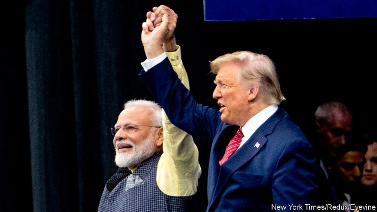

###### Foreign policy

# India’s foreign policy remains cautious and unimaginative 

 

> print-edition iconPrint edition | Special report | Oct 26th 2019 

INDIA STAYED aloof during the cold war, happy to be the flag-bearer for non-aligned nations. With the rise of China and the retreat of America transforming international relations, and with India’s growing sense of its destiny as a soon-to-be great power, some observers believed its foreign policy might change, too. Yet Narendra Modi has struggled to match the country’s big ambitions with its still-limited capabilities. 

The relationship with America has grown closer. But for all the razzmatazz of Mr Modi’s recent rally with Donald Trump in Houston, there has been little progress on difficult issues. A mooted trade deal fizzled as the American team blamed India for protectionist policies. Mr Trump shook his head at India’s “very aggressive” tone towards Pakistan. And, though Mr Modi loudly endorsed Mr Trump, that may look less wise as impeachment proceedings against the erratic American president unfold. 

There are particular pitfalls to dealing with the Trump administration. Yet the mix of going big on public relations while reaping relatively small political dividends seems to be a signature of Mr Modi’s foreign policy. He has shared photo opportunities with Vladimir Putin and Xi Jinping as often as with Mr Trump, with similarly scant returns. Russia, long India’s main source of weapons, now sells weapons to Pakistan, too. 

Mr Xi has avoided direct friction with India at disputed spots on their long, mountainous frontier. But China has made deep inroads in India’s backyard, wooing countries such as Nepal, Sri Lanka and Bangladesh. It has also grown even closer to Pakistan, propping up its economy with billions of dollars worth of arms, infrastructure and investment. China’s navy intrudes with growing frequency into the Indian Ocean, challenging India’s traditional dominance of its own back yard. Yet although the Indian fleet struggles to keep up, Mr Modi still seems to fear partnering with maritime powers that share his unease about Chinese intentions. 

So non-alignment has continued. This means that, although it has no real enemies apart from Pakistan, India also has few friends. That would be fine if it were stronger militarily or economically. But among larger powers it stands out as the only one that relies chiefly on imported arms, and whose military budget is spent largely on salaries and pensions. In addition, its relationship with Pakistan seems stuck, never able to get beyond the ugly tit-for-tat that has characterised the past 70 years. When India struck a guerrilla training camp in Pakistan last February, in retaliation for a terror attack that killed 40 of its soldiers in Kashmir, the Indian public cheered loudly, but the ensuing crisis between the nuclear-armed neighbours necessitated emergency intervention by outside powers. 

It says much that Mr Modi’s biggest foreign-policy success may be to have achieved a relatively muted global response to his recent actions in Kashmir. Yet the lack of international condemnation may reflect compassion fatigue and dislike of Pakistan more than Delhi’s diplomatic skill. Abroad, as at home, Mr Modi’s dreams are bolder than his actions.■ 

