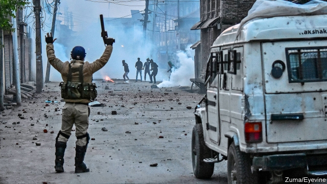
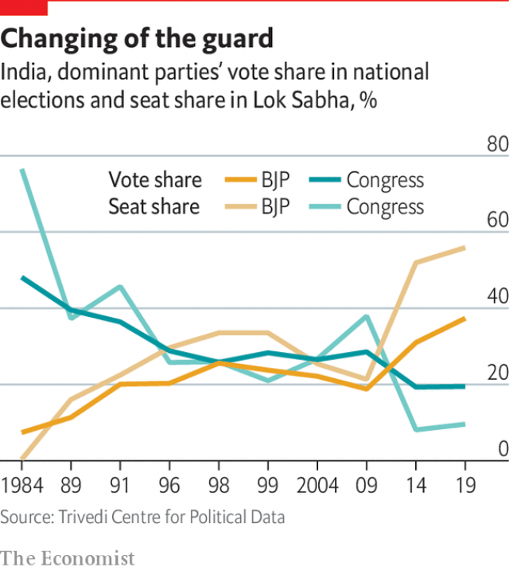

###### The prime minister

# What does Narendra Modi want? 

 

> print-edition iconPrint edition | Special report | Oct 26th 2019 

INDIA’S PRIME MINISTER has a knack for puns. “Hard work is stronger than Harvard,” he quipped when Amartya Sen, a Nobel prizewinning economist, criticised his policies. During last spring’s re-election campaign Mr Modi relentlessly needled his chief opponent, Rahul Gandhi, the Congress party leader and fifth-generation scion of India’s most illustrious political family. The choice, growled the prime minister at rallies across the country, was between naamdar and kaamdar—those who rely on a fancy name, and those who achieve through hard work. 

The cheers brought by such snappy juxtapositions, as well as cascades of votes, tell of more than Mr Modi’s skill with words. They show the depth of resentment he has been able to tap into, simply by parading his own modest caste origins and posing as a proud working man. In the decades when the Congress party dominated politics, paunchy politicians moved into colonial-era bungalows and travelled first class. Sweeping reforms in the 1990s lifted living standards for everyone, but also widened gaps between rich and poor, and between fast-rising aspirations and more slowly evolving opportunities. The same anger that has swept the developed world against self-appointed elites emerged especially strongly in India. Polls showed that Indians, more than citizens of any other democracy, craved a strong leader or even army rule. 

In 2014 Mr Modi seemed just the man. He presented himself first and foremost as an honest, powerful, capable administrator who could fix problems and work for ordinary people. Those ordinary people liked what they heard, and so did businessmen. Tired of bureaucratic sludge, they cheered Mr Modi’s promise of “minimum government, maximum governance”. Addressing concerns raised by his failure as chief minister of Gujarat to prevent a pogrom in 2002 that left some 2,000 people, mostly Muslims, dead, Mr Modi declared that sabka saath—all together—would mean sabka vikas—development for all. 

He also presented a second image of himself: as a devout Hindu combining personal piety, celibacy, closeness to grassroots right-wing Hindu groups and toughness on Muslim issues. The combination of the two made him a powerful campaigner. In office, however, it is not clear which face dominates, the ideologue or the can-do reformer. 

Mr Modi’s government has rolled out, or appropriated and re-energised, dozens of central-government programmes: Smart Cities to eradicate urban squalor, Make in India to boost manufacturing, Digital India to overhaul the supply of government services, along with Clean India, Stand Up India, Start Up India and so on. 

Many of these programmes have been successful: a campaign to replace wood and dung stoves with gas cookers has prevented tens of thousands of lives from being shortened by indoor air pollution. But it is not clear if other initiatives have been as successful as Mr Modi’s administration claims. Polls show that a large majority of voters believe he has boosted India’s prestige in the world, though the main evidence of this seems to be television footage of his foreign visits. Mr Modi’s first term in office could hardly be called transformative. Expected reforms of antiquated administrative structures and of restrictive laws governing labour and land did not materialise. Except for a hardening of rhetoric towards Pakistan, there were no big shifts in foreign policy. 

The biggest transformation came in the prime minister’s office itself. Shunning press conferences, and instead connecting directly with voters via radio talks, tweets and a dedicated “NaMo” app, Mr Modi has made his role far more presidential. Appointing relatively weak ministers, he has pulled more powers into his own office. And he has skilfully and ruthlessly used state institutions to influence the media, punish perceived enemies and undermine the opposition. 

It would seem that Mr Modi’s main focus during his first term was to establish control. Entering his second term with an increased majority of the Lok Sabha’s 545 seats, he faces few checks. True, the BJP won only 38% of the vote, against a respectable 19% for its only real rival, Congress. But the older party’s successive losses have left it demoralised and fragmented. In the few states that it still runs, it is fighting for survival. The power that Mr Modi wields now places him closer to Turkey’s Recep Tayyip Erdogan or Vladimir Putin than to more constitutionally constrained populists such as Donald Trump or Brazil’s Jair Bolsonaro. Now that he has consolidated his power, what will India’s strongest leader in a generation do with it? 

Mr Modi has few academic credentials. His real education came in the Rashtriya Swayamsevak Sangh (RSS), the “volunteer organisation” that is the quiet, steady flagship of an armada of Hindu-nationalist (or “Hindutva”) groups. In his 20s Mr Modi served as an unpaid pracharak or devotee of the RSS, soaking up ideas of India’s past glories and of its subsequent humiliation under 1,000 years of Muslim and Christian rule. His political career began when in 1985 the group assigned him to work in one of the newer members of the Hindutva “family”, the BJP. 

The party was a big success. It captured power in Gujarat in 1995 and made Mr Modi the state’s chief minister in 2001 before elevating him to its national leadership in 2013. He not only led the BJP to two thumping general-election victories, but in the capable fists of his chief henchman from Gujarat, Amit Shah, the party has expanded its membership to 180m people (making it the world’s largest political party) and, with its allies, stormed to power in 18 out of the 29 state assemblies. 

 

During Mr Modi’s first term, hardline Hindus complained that their agenda was not vigorously pursued. His government did move gently on such touchstone Hindutva issues as the building of a Ram temple atop a demolished mosque in Ayodhya, and demands to stamp Indian rule more firmly onto the restive, Muslim-majority state of Jammu & Kashmir. Quietly, however, it carried out a wholesale turnover of personnel that has transformed key institutions. In effect, Mr Modi has implanted a new, RSS-friendly nomenklatura nationwide, ranging from Yogi Adityanath, a far-right Hindu priest who is now chief minister of Uttar Pradesh, India’s most populous state, to the pliant heads of state universities, friendly judges, army officers, boards of state-owned firms and bosses of private news networks. 

In his own office, say former bureaucrats, Mr Modi’s preference for “hard work” over fancy degrees has often meant rewarding loyalty over competence. The previous Congress government frequently ignored advice, says Puja Mehra, author of a book that laments lost economic opportunities under both governments. Mr Modi’s simply got rid of dissenting advisers. The director of a think-tank concurs. “His inner circle don’t listen to anybody with an independent mind. They say, ‘first agree with me’,” he says. “Our civil-service culture is attuned to anticipating what the big man wants. And what Modi wants is control.” 

So far in his second term, Mr Modi’s team has shown less circumspection about its Hindutva agenda. Ram Madhav, a BJP leader, penned a post-election op-ed that hinted at more aggressive purges. The party’s new mandate, he wrote, is a rejection of “the pseudo-secular/liberal cartels that held a disproportionate sway and stranglehold over the intellectual and policy establishment of the country”. In a second term, he insisted, “the remnants of that cartel need to be discarded from the country’s academic, cultural and intellectual landscape.” 

Mr Modi’s move in August to tear down seven decades of complex constitutional niceties that had afforded the Muslim-majority Indian state of Jammu & Kashmir ostensible autonomy was a shock, but one that plenty of opponents had foreseen. The move split the territory in two, placed both parts under direct rule from Delhi and clamped 7.5m people under a virtual blockade. With the issue of the Ram temple having reached India’s supreme court, a BJP minister in Uttar Pradesh crowed that it would soon be built because “the judiciary is ours”. 

Apparently not concerned that a campaign in the state of Assam to check nationality credentials has labelled nearly 2m residents as foreigners, Mr Modi’s government is building prisons to hold them, and says it plans to expand the exercise across the country. Amid Hindutva complaints that many of the supposed intruders are Hindu, the government plans a law that, in a worrying challenge to the secular constitution, will accept refugees from nearby states as long as they are not Muslim. In the meantime Mr Shah, the home minister, has used the BJP lock on parliament to force through laws that reinforce powers of arbitrary arrest and weaken public oversight. 

The prime minister has, to a large extent, already achieved a long-standing goal of Hindu nationalists, by cutting across caste and ethnic boundaries to forge an unusual degree of unity among Hindus. But in doing so he has deepened yet another of India’s divides. For decades the country’s underlying debate has been about whether to be strong by embracing diversity as a nation of citizens with equal rights or by fashioning India as a Hindu state. 

Many, perhaps even most, of his own voters may not have intended it, but Mr Modi’s election victory has settled that debate in favour of Hindutva. And Mr Modi may not have intended it, but at street level the shifting balance can be seen in cruder form, as Hindu vigilante groups violently enforce bans against the slaughter of cows, or simply harass people who too obviously belong to the world’s largest minority, India’s 190m Muslims. 

The underlying message is that either Muslims submit, or they fight and we crush them, says Harsh Mander, who runs a group working with victims of communal violence. He fears the country has rejected ideals of kindness and consensus in favour of self-righteous force. “When there were riots in Delhi after Partition, Mahatma Gandhi said he would not leave the city until there is not a single Muslim child who would feel afraid here,” he says. “And look where we are now.”■ 

