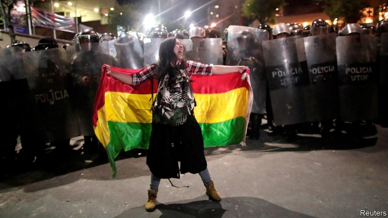

###### Evo won’t go

# Bolivia’s baffling ballot count 

 

> print-edition iconPrint edition | The Americas | Oct 26th 2019 

JUST WEEKS after rains extinguished widespread forest fires, Bolivia is burning again. Convinced that President Evo Morales is trying to steal the presidential election held on October 20th, supporters of the opposition set fire to the headquarters of the electoral authorities in at least five provinces, clashed with police and government supporters and toppled a statue of Hugo Chávez, Venezuela’s late socialist leader. On October 23rd, with no winner declared, civic organisations throughout the country held a general strike. They said the protests would stop only if the electoral court called new elections or declared that a second round would be held in December between Mr Morales, a leftist, and Carlos Mesa, his centrist rival. 

Hours after polls closed the electoral court stopped publishing the results of the rapid count, which is based on photographs sent from voting stations. With 84% of ballots counted, it showed Mr Morales with a seven-point lead over Mr Mesa. The president needs a ten-point gap to avoid a runoff. When reporting resumed a day later, Mr Morales had his ten-point lead. The head of an observer mission from the Organisation of American States (OAS) said he was “profoundly concerned” about the “inexplicable” change in the tally. 

As The Economist went to press, Mr Morales’s lead had narrowed again, to 9.3% points with 98% of the ballots tallied in the official count. If the gap does not widen again, there should be a second round. Mr Mesa, who could unite the opposition, would have a good chance of ending Mr Morales’s 13 years in power. Even if that happens, the anger on both sides caused by the confused vote tally is likely to linger. 

The electoral court, which is manned mainly by Morales loyalists, has given no convincing explanation for the pause. On October 22nd its vice-president resigned, saying the decision to stop the rapid count had “resulted in the discrediting of the entire electoral process, causing an unnecessary social convulsion”. The OAS has now accepted an invitation from the government to audit the election. 

Tensions were high before the poll. Hundreds of thousands of Bolivians took to the streets to protest against the candidacy of Mr Morales, who is running for a fourth term in defiance of the constitution and of a referendum vote. The candidates’ responses on the night of the election fuelled the flames. When the rapid count stopped, Mr Mesa accused the government of electoral fraud. Mr Morales declared outright victory. 

The interruption in vote-counting reminded many of what happened in Honduras in 2017, when the president, Juan Orlando Hernández, went from laggard to leader after a mysterious lull. Mr Hernández’s victory sparked months of protests in which at least 23 people died. 

No one has been killed in Bolivia’s protests. But tempers are still high. While Mr Mesa’s supporters fume, the president’s fans see the smouldering buildings that house the electoral court as evidence of an attempt to disenfranchise them. Mr Morales said the narrowing of his lead showed that the opposition and foreign powers are staging a coup. Just half of Bolivians will accept the legitimacy of the next president, whoever he is. Bolivia may burn again.■ 

