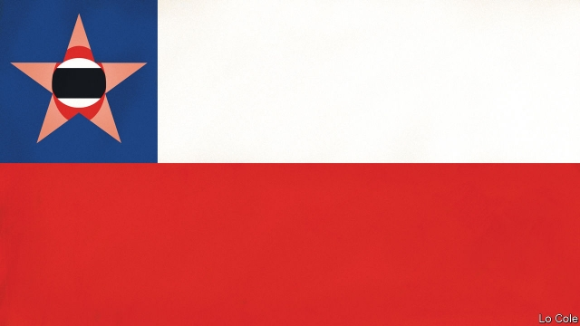

###### Bello

# Days and nights of rage in Chile 

 

> print-edition iconPrint edition | The Americas | Oct 26th 2019 

WITH SIX lines, modern trains and 136 stations, the Santiago metro is in many ways a model public service in a region where such things are lacking. It carries 2.7m passengers a day in a city of 7m, and has persuaded part of the middle class to leave their cars at home. But in a paroxysm of rage that began on October 18th protesters set fire to stations and trains, leaving only one line operating. This arson was part of a collective nervous breakdown in Chile, ranging from peaceful protests demanding a fairer and less unequal society, to nightly looting of supermarkets and feral criminality, with marauding delinquents robbing homes. Sebastián Piñera, the centre-right president, declared a state of emergency and curfew and sent the army onto the streets for the first time since General Augusto Pinochet’s dictatorship. At least 18 people died, most of them looters. 

These events have shaken what was Latin America’s most stable and successful country. They come as the region is convulsed by turmoil. Rioting forced Ecuador’s government to reinstate fuel subsidies. Peru’s president has dissolved the country’s congress. Protests hit Bolivia, where the president may be trying to steal an election. Populists are in power in Brazil and Mexico and will be soon, perhaps, in Argentina. 

The details vary. But there are some common threads. They include the sense of frustrated expectation among the region’s middle classes. Six years of economic stagnation have made Latin America’s deep inequalities less tolerable. Corruption scandals have discredited politics and politicians. Weak political parties no longer channel discontents. There is a copycat element: arsonists have smart phones, and watch events in Barcelona, Paris or Quito. 

The immediate trigger in Chile was a modest 3.7% rise in the metro’s peak-hour fares, but discontent has been growing there for more than a decade. Since 1989 the country’s restored democracy has maintained the broad outline of the free-market policies installed by Pinochet���s dictatorship. Those policies have brought economic success. The poverty rate has fallen from over 40% in 1990 to under 10% today. The middle classes now form a majority. Income inequality is below the Latin American average. Still, many Chileans struggle to make ends meet. 

Polls show that many Chileans think the country’s democracy is rigged in favour of a small elite, and they have a point. Economic and political power is concentrated. Some years ago your columnist attended a drinks party of about 60 people in Santiago. A friend whispered in his ear: “You realise that half of Chile’s GDP is in this room.” 

The rich pay less tax as a share of income in Chile than in other countries in the OECD, a club of mainly developed economies. Most Chileans worry about “low pensions, lack of access to decent housing, health care and medicine, and of again falling into the poverty from which they escaped”, the rector of the Catholic University, whose economists dreamed up the Chilean “model”, wrote this week. 

Mr Piñera, a billionaire who was president from 2010 to 2014, is part of that elite. He was re-elected in 2017 because in his first term the economy (helped by high copper prices) grew faster than under his successor, Michelle Bachelet, a Socialist. “Better times are coming,” he promised. Voters are still waiting, partly because Chile’s open economy is harmed by President Donald Trump’s trade war with China. Though lacking in spontaneous empathy, Mr Piñera was trying to inject a little more fairness into Chile’s system, as Ms Bachelet did. He promised a bigger public top-up for a private pension system that offers an average benefit of just $340 a month. 

But the improvements have been slow to come. Take the health system. Much care is provided by private insurers. A middle-class woman pays around $300 a month (and extra for medicines and operations). Insurers refuse to cover pre-existing conditions, making it hard to switch providers. Many pensioners cannot afford the premium, just when they need care most. 

Mr Piñera seems to have got the message. After cross-party talks, he announced an immediate boost to pensions and health-care coverage by the state. Left-wing opponents have been rejoicing at his travails. But that may be premature. The Chilean model can be improved with more social provision and a crackdown on oligopolies. It does not need reinvention.■ 

