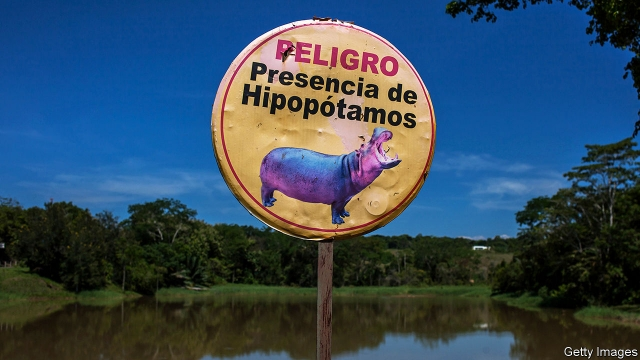

###### Pablo Escobar’s love for animals

# How to handle Colombia’s narco-hippos 

 

> print-edition iconPrint edition | The Americas | Oct 26th 2019 

AMONG PABLO ESCOBAR’S few endearing qualities was his love of animals. In the 1980s the drug lord brought perhaps a half-dozen hippos to join the rhinos, giraffes, zebras and camels at his zoo at Hacienda Nápoles, his mansion east of Medellín. After he was killed in 1993, anti-narcotics agents moved the camels and zebras to other zoos (the giraffes predeceased him). They did not tangle with the big, aggressive rhinos and hippos, which went free. 

The rhinos, which are less hardy, quickly died out. The hippos, though, are thriving, in part because big cats and hyenas, their predators in Africa, are absent from Colombia. At least 50 adult hippos wallow happily in the Magdalena river, 18km (11 miles) from Hacienda Nápoles. “We might be dealing with 200 hippos in 20 years,” says David Echeverri, a biologist at the Regional Corporation for the Negro and Nare Rivers (Cornare). 

Other species are not faring so well. The hippos are competing for food and destroying their habitats. That is a threat to the local manatees, an endangered species in Colombia. Hippo dung sucks oxygen from riverside marshes, dooming some fish. 

The easiest answer would be to deal with the hippos the way Escobar did with people who got in his way. But after hunters, acting on government orders in 2009, shot Pepe, one of Escobar’s original hippos, because he was stomping on crops, animal-rights activists sued the government. A court ruling now prohibits hunting hippos. Zoos don’t want them. Local authorities don’t have the money to sterilise hippos quickly. By the time they neuter one, four or five more are born, says Mr Echeverri. Sending them back to Africa is not an option. The Colombian population is inbred. No one knows how their genes would affect the African herd. And they might carry diseases lethal to African fauna. 

The last hope is birth control. Scientists are working on it, and say that if no hippo-specific contraceptive is ready by the end of the year they’ll try out one that works on pigs. They expect opposition from animal lovers. The scientists’ response: think of the manatees.■ 

