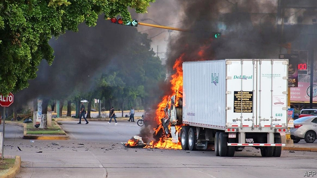

###### The AMLO doctrine

# Lessons from a shootout in Sinaloa 

 

> print-edition iconPrint edition | The Americas | Oct 24th 2019 

THE GUN battle on the streets of the Mexican city of Culiacán was, once again, a tale of organised crime against the disorganised state. It started as an attempt by soldiers and other armed law enforcers to arrest a much-wanted suspect: Ovidio Guzmán López. His father, Joaquín (aka “El Chapo”), once ran the Sinaloa drug gang and is serving a life sentence in an American prison. Chapo junior is thought to lead a faction of the gang, along with his brother. But soon after security forces nabbed him on October 17th, reinforcements from the family business arrived. As lorries burned and bullets cracked across the city, bystanders picked up their children and fled. At least 14 people died. Outnumbered, the soldiers let Chapo junior go free. 

This was a novel kind of failure. Shoot-outs have been commonplace since 2006, when the then-president, Felipe Calderón, mobilised the army to fight drug gangs. The state has also suffered its share of humiliations, not least the escape from a Mexican prison of El Chapo in 2015. But never has the government buckled so publicly to the power of gangsters. 

The deployment of just 30 soldiers with no secure perimeter and no air support suggests that the operation in Culiacán, Sinaloa’s capital, was poorly planned. To make matters worse, some 50 inmates broke out of a nearby prison during the mayhem. The government eventually claimed that its surrender had, in fact, averted a massacre. 

The episode in Sinaloa revealed much about the confused policies of Andrés Manuel López Obrador, Mexico’s populist president, for dealing with the scourge of violence. He laments decades of economic stasis which, he argues, have pushed the poor into crime. And he is sceptical of using force to fight criminals. On October 20th Mr López Obrador, who is commonly known as AMLO, said past presidents had “turned the country into a cemetery” by “wanting to put out fire with fire”. His crime-fighting plan relies on a mix of welfare for the young, a clampdown on corruption and a new 60,000-strong national guard. He also talks of legalising cannabis and other drugs. “Think of your mothers,” he urges youngsters considering a life of crime. It is not enough. 

The president predicted in April that, with this formula, homicides would drop within six months. But the number of murders per month has risen since them. This year’s toll is likely to exceed last year’s 33,000. That was the highest ever. 

It is possible that neither the president nor Alfonso Durazo, his security secretary, authorised the botched raid in Culiacán. Whoever did may have been in search of a trophy. It would have been the first big one for the president’s national guard, created this year. The United States, which has requested Chapo junior’s extradition on drug-trafficking charges and is keen to learn the whereabouts of Chapo senior’s $13bn of loot, may have leaned on Mexico to make the arrest. However it started, the debacle made clear that the government is unwilling to spend much money on catching high-level drug traffickers, says David Shirk of the University of San Diego. 

Unchecked, gangs will commit crimes like extortion, induce corruption and terrorise citizens. But their existence alone need not send killings rocketing. The murder rate tends to rise when a gang’s power is threatened by the state, by a rival or by pressure from civil-society groups. Gang members defend their rackets with force. Almost any attempt by the state to constrain gangs risks triggering a rise in violence. 

For governments eager to reduce it, going easy on gangs, as AMLO was doing before the shootout, can seem the easiest tactic. In El Salvador the government secretly brokered a truce between gangs in 2012 that halved the murder rate. Even as the government of Mr Calderón waged a war on organised crime, it disproportionately locked up the rivals of the Sinaloa gang, raising suspicions that it was merely seeking to give Mr Guzmán senior a peaceful monopoly. The strategy of presidents before AMLO of removing kingpins caused infighting, as would-be heirs killed each other to seize vacant thrones. Splintering gangs found new lines of work, such as fuel theft, and spread across the country. 

AMLO may be betting on an implicit deal in which the state and the crime groups treat each other gently, buying time for poverty-eradication to work its pacifying magic. On that theory, the Culiacán operation was a departure from his strategy rather than an expression of it. But pacts can go wrong. When the truce in El Salvador fell apart, the murder rate rose to a higher level than it had been before. 

The worry is that the debacle in Culiacán signals to gangs that if they threaten enough bloodshed the state will bend to their will. AMLO has given them the incentive to be more violent and unreasonable when threatened, not less. 

Even if the murder rate falls because the government attacks gangs less aggressively, there is little reason to expect success from AMLO’s plan to undermine their power. Mexico’s spending on security is far below that of other Latin American countries as a share of GDP. The president’s silver bullet against recruitment—rapid economic growth—is proving tricky to discharge. His national guard is composed mostly of soldiers trained for combat, not policing, with a new logo on their uniforms, says Alejandro Hope, a security analyst. It does not always go to areas with the most violence. A tenth of the force is nabbing migrants to please President Donald Trump. 

AMLO’s crime-fighting plan is “not a broad strategy for improving law enforcement”, says Mr Hope. Elements of such a strategy, such as raising the quality of state and local police forces and strengthening the judiciary, are missing from it. 

Chapo junior had barely been whisked to safety when the internet began flooding with narcocorridos, flattering ballads about gangsters that often featured his father’s audacious escape. “The reckless government went to wake up the child,” crooned one singer. “Now they woke him up and they don’t know what to do.” With a few small changes, it is the same old song.■ 

