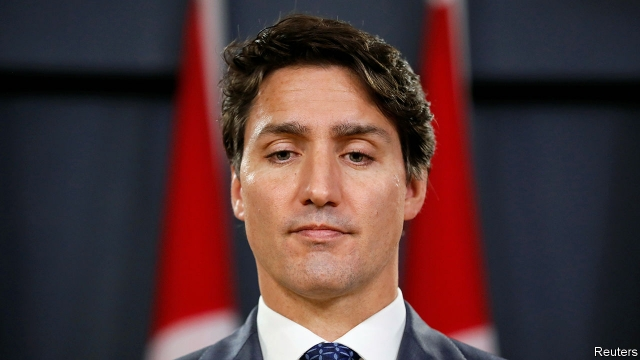

###### The Liberals limp back

# The chastening of Justin Trudeau 

 

> print-edition iconPrint edition | The Americas | Oct 26th 2019 

ON THE MORNING after election day, Justin Trudeau appeared at a metro station in his Montreal constituency of Papineau to offer hugs, kisses and selfies to commuters. Perhaps he was in need of an ego boost. Although he survived as prime minister, his Liberal Party lost its parliamentary majority and received fewer votes than the opposition Conservatives (see chart). The election exposed deep regional divisions and will compel him to seek support for his programme from rival parties. “Canadians rejected division and negativity,” he declared after his victory. In fact, those principles were the basis on which many voted. 

The negativity came largely from Mr Trudeau’s missteps in office. He pressed his attorney-general to intervene in the prosecution for bribery of SNC-Lavalin, an engineering firm in Quebec. Parliament’s ethics minister rebuked him for that. Mr Trudeau was also embarrassed by the publication during the campaign of photos of him wearing brown- and blackface as a young man. Andrew Scheer, the Conservative leader, sought to capitalise on those errors with the taunt that Mr Trudeau is “not as advertised”. It nearly worked. 

Mr Trudeau would be right to claim that Canadian voters rejected one sort of division. The election did not turn on issues of immigration and identity, as some analysts had feared it might. The Conservatives did not oppose Canada’s high levels of immigration. The only party that does, the populist People’s Party, won no seats. Its leader and only MP, Maxime Bernier, lost his. Although the Conservatives outpolled the Liberals, most votes went to parties that prefer the redistributionist policies favoured by Mr Trudeau to the small-state philosophy of Mr Scheer. 

 

The splits laid bare by the election are mainly regional. The Liberals lost their five seats in the western oil- and gas-producing provinces of Alberta and Saskatchewan. The Conservatives won all but one of the provinces’ 48 seats. In Quebec, Canada’s French-speaking province, the big winner was the Bloc Québécois, a separatist party. 

Mr Trudeau’s main problem will not be finding support for his policies in Parliament. Canada is accustomed to minority government. The risk is that these policies will widen the regional chasms that the election exposed. 

The Liberals’ main partner is likely to be the left-wing New Democratic Party (NDP), led by Jagmeet Singh. It will be no obstacle to enacting Mr Trudeau’s main legislative priorities. These include a fresh tax cut for the middle class, a ban on assault weapons and more ambitious targets for reducing emissions of greenhouse gases. The two parties also agree on investing in low-rent housing. Both want a federal-government-run drug plan, but Mr Singh’s ideas would probably be more expensive. He laid out other preconditions for supporting Liberal policies on election night, which would tug the government to the left if Mr Trudeau accepted them. Mr Singh wants a new “super wealth tax”, for example. 

The two parties’ agreement on the principle of fighting climate change (shared by the Greens and the Bloc Québécois) is bound to raise tensions with the western prairie provinces. Mr Trudeau’s previous government sought to reduce them by backing the Trans Mountain Expansion (TMX), a project to expand an oil pipeline from Alberta to a terminal near Vancouver. In 2018 it bought the pipeline from a private firm. Mr Trudeau had hoped this would reconcile Alberta and Saskatchewan to his signature environmental policy: a national floor for the price of carbon emissions, which took effect this year. 

As the election showed, it did not work. Alberta and Saskatchewan have long chafed at the greater power of the more populous central provinces of Ontario and Quebec. Their anger has deepened since 2014, when global oil prices slumped, causing regional hardship. Jason Kenney, the Conservative premier of Alberta, blames the Liberals’ climate-change policies for worsening the situation. 

During the campaign, Mr Trudeau stoked those resentments as a way of winning votes from the NDP and the Greens. In the final party leaders’ debate, he abandoned his usual talk of balancing green goals with developing natural resources. Instead, he attacked “oil interests” and provincial leaders opposed to his climate-change policies. The election has given a fillip to separatist sentiment in Alberta. 

More surprisingly, it has also revived the issue of Quebec separatism, a force that threatened Canada’s integrity from the 1970s to the 1990s but has lately seemed dormant. Yves-François Blanchet, the Bloc Québécois’s leader, downplayed its separatist aspirations during the election campaign. The party’s surprising resurgence is probably largely the result of identity politics, a more potent theme in Quebec than in other provinces. Mr Blanchet endorses a controversial law passed by Quebec’s right-leaning government this year that prohibits many civil servants from wearing religious symbols, including turbans, hijabs and kippas. The Bloc owes some of its electoral success to the collapse in support in Quebec for the NDP, whose leader, Mr Singh, is Sikh and wears a turban. 

Mr Blanchet says his party will back the Trudeau government when its policies are good for Quebec and seek to thwart those that are not. It could endorse much of the Liberals’ economic and environmental programme. But a clash may occur over Quebec’s religious-symbols ban. Mr Trudeau is under pressure from supporters to challenge it in court. 

All this means Mr Trudeau will find his second term harder than his first. The son of a former prime minister, he must hope that his fortunes follow his father’s. In an election in 1972 Pierre Trudeau saw his Liberal majority government reduced to a minority. Two years later he won a new majority. He ended up governing, with a brief interruption, until 1984. His son no doubt hopes for a similar comeback.■ 

