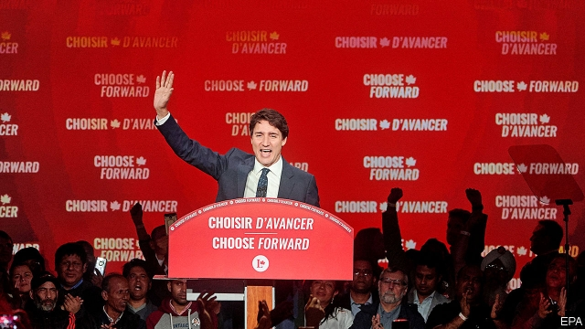
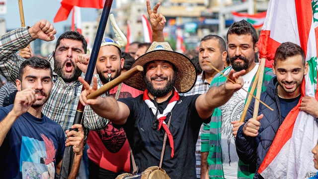

###### A woman with a plan

# Politics this week 

 

> Oct 26th 2019 

Canada’s prime minister, Justin Trudeau, won a second term in office but his Liberal Party lost its majority. The Conservative Party won the popular vote and wiped out the Liberals in the oil-producing western provinces of Alberta and Saskatchewan. To enact his programme, Mr Trudeau will depend on support from smaller parties, especially the left-leaning New Democrats. See article. 

Protests against a fare increase on the metro in Santiago, Chile’s capital, became violent, prompting the government to impose its first curfew since the end of a military dictatorship in 1990. The unrest spread to other cities. At least 18 people died in rioting. See article. 

Bolivia’s opposition accused the government of Evo Morales, the country’s leftist president, of attempting electoral fraud. In the early count in the presidential election his centrist rival, Carlos Mesa, appeared to be doing well enough to enter a run-off. But the count was mysteriously suspended. When it resumed, Mr Morales’s lead had widened, sparking protests. See article. 

Brazil’s senate approved a reform of the country’s absurdly generous pensions. It raises retirement ages and increases workers’ contributions, and is thus expected to reduce the growth of Brazil’s debt. 

Mexican security forces captured and then released the son of Joaquín Guzmán (aka “El Chapo”), the jailed former leader of the Sinaloa drug gang. The operation in the city of Culiacán led to a gun battle in which the soldiers were outnumbered; 14 people died. See article. 

Boris Johnson secured a new Brexit withdrawal deal with the European Union, but was compelled to request a further extension past October 31st, which he does not want. The British prime minister’s deal won a majority in one of its stages through Parliament, but his three-day timetable to scrutinise the bill was rejected. EU governments discussed whether to grant an extension, and for how long. See article. 

Abortion and gay marriage became legal in Northern Ireland, despite a last-ditch effort by conservatives to prevent the change. The measures have already made an impact. A judge in a case in which a woman had bought abortion pills instructed the jury to acquit her. 

A lorry was discovered just east of London with 39 dead suspected migrants—thought to be Chinese nationals—inside. See article. 

An EU summit shocked leaders in the Balkans when it declined, mainly because of pressure from France’s president, Emmanuel Macron, not to begin accession negotiations with North Macedonia and Albania. See article. 

Two Green parties made significant gains in a general election in Switzerland, taking a combined fifth of the vote. The right-wing populist Swiss People’s Party came first again in the multi-party system, but saw its share of the vote dip to 26%. 

Russia and Turkey struck a deal over northern Syria. Turkey has invaded the region in an effort to push out the Kurds after America, which had backed them, withdrew. Russian and Syrian forces will now ensure that the Kurds pull back 30km from the border. Russian and Turkish forces will then patrol the Syrian side. But Turkey’s “buffer zone” is not as wide as it had hoped. See article. 

A month after an election that ended in deadlock, Israel’s prime minister, Binyamin Netanyahu, said he was unable to form a new coalition government. Mr Netanyahu’s political rival, Benny Gantz, was then invited to try. Mr Gantz’s alliance, though, is more than a dozen seats short of a majority. 

 

The government of Lebanon approved a package of reforms in response to big demonstrations. Hundreds of thousands of people have taken to the streets, unhappy with the struggling economy and poor governance. See article. 

Mmusi Maimane resigned as leader of the Democratic Alliance, the largest opposition party in South Africa. Mr Maimane was the first black person to head the traditionally white DA. His departure suggests it still has a problem reaching out to black voters. 

Thousands of people took to the streets in Guinea, as President Alpha Condé considered scrapping the constitution. See article. 

Russia hosted dozens of African leaders at a summit in Sochi, as part of an effort by Vladimir Putin to exert more influence on the continent. See article. 

America’s most senior diplomat in Ukraine told congressmen that Donald Trump had explicitly tied his request to dig up dirt on Joe Biden to a threat to withhold military aid. Earlier, Rick Perry announced his resignation as energy secretary. He is under scrutiny for his role as one of the “three amigos” who liaised with Ukrainian officials. See article. 

Elijah Cummings lay in state in Congress, the first black politician to be accorded the honour. Mr Cummings represented Baltimore for 23 years before he died at the age of 68 earlier this month. 

Hong Kong’s government formally withdrew the extradition bill that in June sparked an anti-government movement, which continues to roil the city. The legislation would have allowed suspects to be sent to mainland China for trial. Protesters say scrapping it will not satisfy their demands, which include full democracy. 

The navies of China and Japan staged their first joint exercise in eight years, which involved ships practising communications in waters south of Japan. Sino-Japanese relations are thawing after years of tension. 

Family members buried the ashes of Zhao Ziyang, the Chinese Communist Party’s chief during the Tiananmen Square protests of 1989 who was removed for sympathising with the protesters. The ceremony marked a concession by the authorities. 

Joko Widodo was sworn in for a second term as president of Indonesia. His new cabinet includes as defence minister Prabowo Subianto, the former general whom he beat in April’s presidential election. See article. 

The most senior American commander in Afghanistan revealed that the number of American troops in the country had fallen by 2,000 over the past year, to 12,000. America had been poised to withdraw even more troops as part of a peace deal with the Taliban that fell apart last month. 

King Vajiralongkorn of Thailand stripped his official mistress of all her titles and honours for being too uppity. He had designated her as “royal noble consort” only three months ago. See article. 

