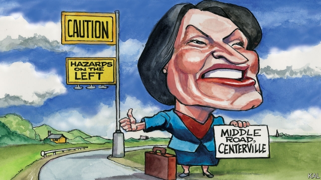

###### Lexington

# Amy Klobuchar for sanity 

 

> print-edition iconPrint edition | United States | Oct 26th 2019 

IF YOU WERE among the 8m people who watched this month’s Democratic primary debate in Ohio, you might think Democrats are chiefly concerned about health care or foreign policy. To hear Joe Biden, you might even suppose taxes on people “clipping coupons in the stockmarket” is something their voters care about. But you would be wrong. Poll after poll suggests most are overridingly concerned to defeat Donald Trump. And they are willing to select whichever primary candidate they think likeliest to do that. While this has given rise to an arcane debate on the left about whether “electability” is even a thing (left-wingers, who win few elections, say it is not), Democratic voters might consider that one of their primary candidates already has a history of pegging back Mr Trump’s electoral gains. That is Senator Amy Klobuchar of Minnesota—whom Lexington recently joined aboard her shiny new “Amy for America” bus in eastern Iowa. 

Brisk, diminutive, with a line in self-deprecating humour—and another in comfortable cardigans and shoes—the 59-year-old politician offered herself to the small crowds of Midwesterners awaiting her as one of their own. The title of her autobiography—“The Senator Next Door”—“might have been written for Iowa!” she joshes in Cedar Rapids. She can see Iowa from her front porch in Minneapolis, she says in Sigourney, a flyspeck of coffee and antique shops amid vast acres of corn country. 

She can see Canada from it, too, she adds, in a quick pop at Sarah Palin, between listing her centre-left policies. Ms Klobuchar is for making Medicare more available but not free for all. She is for expanding access to public college, but not free four-year degrees. She is for banning assault weapons but not forcibly buying back the millions in private hands. Midwesterners like their politics unthreatening, realistic and with a touch of humour to smooth over areas of disagreement, she believes. The facts back her up. Some of the Democrats’ biggest gains in last year’s mid-terms were made in the Midwest by pragmatic candidates who argued, as she does, that “to be progressive you have to make progress”. She also has a record of outperforming her party in Minnesota by wooing independents and moderate Republicans. Last year she won re-election by 24 points in a state Hillary Clinton won by two. 

That was one of the most stunning results of the 2016 election. Minnesota last went for a Republican presidential candidate in 1972. That Mr Trump came so close to breaching such a strong section of the erstwhile Democratic “blue wall” encapsulated his strategy of sweeping up ageing white Midwesterners. It gave him narrow wins in Michigan, Wisconsin and Pennsylvania (which is Midwestern in part), and will again be his likeliest route to victory next year. If he can hang on to even one of those states, or crack Minnesota, he will probably win re-election. If he loses them, he probably won’t. Trump-averse Democrats should therefore ask themselves this question: Who can win the Midwest? And if they do they will find Ms Klobuchar—who would beat Mr Trump in Minnesota by 17 points, according to the latest polling—ready with a half-decent joke. “We’re going to build a blue wall around those states and make Donald Trump pay for it!” 

Then why is she not doing better in the polls? The Economist’s aggregate puts her on only 2%. She points to the early stage of the race, the congested field and greater name-recognition for the front-runners. A pithier response would be: Mr Biden. The former vice-president has dominated the primary’s moderate lane despite his familiar shortcomings as a campaigner and more recent doubts about his mental acuity. Having decided he would be likeliest to beat Trump, his supporters have been forgiving. Yet Mr Biden’s seat-blocking candidacy has made it hard for lesser-known though perhaps more compelling moderates to get attention. It persuaded Senator Sherrod Brown of Ohio not to enter the race, has put paid to Governor Steve Bullock of Montana and pushed Senator Kamala Harris further to the left than she otherwise might have gone. Given Mr Biden’s weakness, true left-wingers such as Elizabeth Warren have meanwhile had a free run at framing the debate. 

Yet Mr Biden may now be in trouble. Ms Warren has overhauled him, his fundraising is in crisis and the likeliest-looking moderate alternatives—Ms Klobuchar and another Midwesterner, Mayor Pete Buttigieg of Indiana—have some momentum. After both piled into Ms Warren in Ohio, they were rewarded with a gusher of donations that might previously have gone to Mr Biden. 

Mr Buttigieg appears better placed to take advantage; he is brilliant, a fresh face and has a big lead on Ms Klobuchar in fundraising and a smaller one in the polls. Yet for risk-averse Democrats he has two potential handicaps. He has never won an election outside South Bend. He also has hardly any support from African-Americans—and as an openly gay man dogged by poor race relations in his home city, he may struggle to woo them. 

Ms Klobuchar is also imperfect. Her charisma is more apparent in Sigourney than on the national stage. And she has a reputation for being not terribly “Minnesota nice” to her staffers. Yet that should not matter against Mr Trump—a one-man Democratic turnout machine with the highest staff turnover of any modern president. And Ms Klobuchar has three strengths. She has an electoral record to scare Mr Trump. She appears relatively inoffensive to left-wingers, while hewing as close to the centre as her party’s leftward drift allows. (Her platform, which includes a promise of a $15 minimum wage, is notably to the left of Mrs Clinton’s.) 

In straightforward Midwestern style, she also seems to know who she is—unlike Mr Buttigieg, Ms Harris and even Ms Warren, all of whom can seem torn between leftist idealism and reality. “I’m a dose of sanity,” she says. “If you’re tired of the noise and the nonsense, tired of the extremes, you’ve got a home with me.” Anxious Democrats might yet consider that to be good enough.■ 

