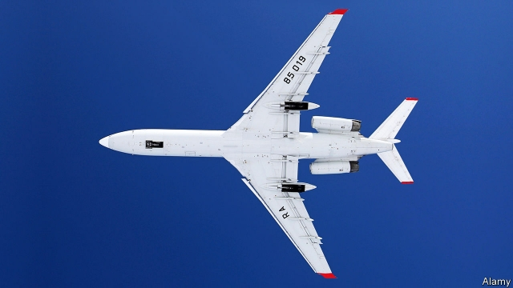

###### Spying the end

# Donald Trump is set to rip up another arms-control treaty 

 

> print-edition iconPrint edition | United States | Oct 26th 2019 

THE RUSSIAN Tupolev TU154 took off from Wright-Patterson air-force base near Dayton, Ohio, on October 22nd. As it headed north over Chicago and Milwaukee, taking in views of Lake Michigan, then west over South Dakota and Montana, a camera on its belly snapped photos of American military installations and civilian infrastructure. But this was not a covert spy operation. It was the eighth time this year that a Russian aircraft has flown over America under the Open Skies treaty, a pact that allows its 34 signatories to make unarmed reconnaissance flights over any part of one another’s territory. Alas, the treaty may soon become the latest addition to the Trump administration’s bonfire of arms-control agreements. 

The concept of Open Skies germinated early in the cold war. In 1955 President Dwight Eisenhower suggested that America and the Soviet Union should not only exchange maps of all their military installations, but also allow the other side to fly over them to build confidence that an attack was not being planned. Nikita Khrushchev laughed off the idea as an “espionage plot”. But when the Berlin Wall fell and the Soviet Union dissolved, the idea was revived and the treaty signed in 1992. 

It is, as Khrushchev suggested, a form of legalised spying known as co-operative monitoring. Countries may conduct a set number of flights virtually anywhere, as long as they give 72 hours’ notice of the mission and a day’s notice of the flight path. They can use only unclassified cameras of 30cm-resolution, which may be inspected. And they must share the product with any signatory who wants it. About 1,500 flights have been conducted to date. 

For several years America has complained that Russia is not playing it straight. The treaty allows countries to keep planes 10km away from their borders with non-signatory states. Russia uses that exemption to stop others getting close to parts of two breakaway Georgian territories that it (but virtually nobody else) recognises as independent and therefore outside the pact. It has also placed a 500km limit, ostensibly on safety grounds, on the total length of surveillance flights above Kaliningrad, a small exclave wedged between Poland and Lithuania that bristles with missiles. In September Russia also denied a request to fly over its massive Centre-2019 military exercise, which consequently went unobserved. 

European officials mostly consider these problems to be irritants that could be worked out. Not so the hawkish John Bolton, who until September 10th served as Mr Trump’s national security adviser. Mr Bolton drew up a memo directing America to pull out of the treaty and lodged it in the national-security apparatus like a stink-bomb. Mr Trump is reported to have signed the directive a few weeks after Mr Bolton’s departure without consulting the Pentagon, State Department or allies. But there has been no formal announcement yet and under the terms of the treaty, America must give six months’ notice of its intention to withdraw. 

Even former officials who support the agreement acknowledge that Russia largely uses the flights to monitor the critical national infrastructure that it would seek to attack in a war. America has less need of planes to do this sort of thing because it has the world’s most advanced spy satellites—a fact that Mr Trump demonstrated to the world when he tweeted a spectacularly detailed photo of an Iranian rocket launchpad on August 30th. 

But supporters of Open Skies insist that Russia’s supposed advantage from the treaty has been overstated. “If they really wanted, Russia could basically collect nearly all they get from Open Skies flights via their national technical means, be it overhead or covert collection on the ground,” says Thomas Moore, an expert who formerly served with the Senate Committee on Foreign Relations. 

Moreover, the flights ensure that NATO and Russian officers meet routinely, building familiarity and trust when both are in short supply. “Not only do Western countries collect imagery from their overflight, they also get a feel for the blood pressure in the Russian air force,” notes Steffan Watkins, an analyst who studies the treaty. 

But the treaty’s most compelling rationale is that most of America’s allies will never be able to afford multi-billion-dollar spy satellites in the first place. For a country like Ukraine, Open Skies flights might provide the only chance to peer at Russian troop movements across the border. As Russia conducts larger snap exercises, often without proper notification, such monitoring has grown in importance. Between 2002 and 2016 American observers flew over Russia 196 times, with only 71 Russian flights over America. 

Concern is mounting about America’s possible withdrawal from the treaty. George Shultz, a former secretary of state, William Perry, a former secretary of defence, and Sam Nunn, a former Democratic senator, wrote on October 20th that pulling out would be a “grave mistake”. The Pentagon and State Department are similarly worried and Robert O’Brien, Mr Bolton’s successor, is said to be slow-walking the order. America’s allies have been working the phones, urging Mr Trump to reconsider. However much the president may dislike the prospect of a Russian jet humming a few thousand feet above Washington, his allies will be telling him they love the idea of their own buzzing over Moscow.■ 

