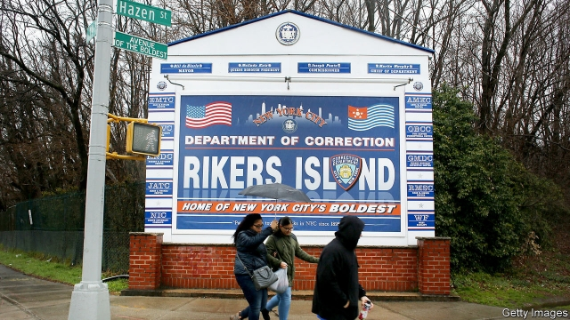

###### Torture Island’s final sentence

# Rikers, one of America’s most notorious jails, is to close 

 

> print-edition iconPrint edition | United States | Oct 26th 2019 

BEFORE THE jail on Rikers Island opened in 1935, the New York Daily News reported that prisoners “will have the privilege of serving their time in the finest and most up-to-date penitentiary in the United States.” The island jail was anything but. Within a few years of its opening the island was overrun with rats, overcrowded, filthy and dangerous. Violence among the inmates was common; the guards did not hold back much either. 

Over the years Rikers has housed Tupac Shakur, a rapper, Sid Vicious, a punk rocker, David Berkowitz, a serial killer, Mark David Chapman, who murdered John Lennon, as well as thousands of murderers, drug dealers, thieves, and the many too poor to get bail. But on October 17th Rikers got its own final sentence. New York’s city council voted to close the jail for good in 2026. That fulfils a promise made by Bill de Blasio, the mayor, in 2017, to close the jail within a decade. 

Attempts to improve conditions at Rikers have largely failed. Mr de Blasio ended solitary confinement for juvenile offenders and last year removed them altogether. But huge problems remain. Sewage regularly backs up and some of the buildings lack air-conditioning, which in summer is dangerous as well as unpleasant. Visitors can reach the island only by a single bus route and a bridge, making it hard for families to visit locked-up relatives. Deaths and abuse persist: after an investigation in 2014 Preet Bharara, then a federal attorney, reported that there was a “culture of violence” on the island. 

Some 80% of the inmates have not been convicted of any crime. Rikers, like most jails in America, holds people awaiting trial or serving short sentences. Half the inmates suffer from mental illness. Many wait months or even years for a court hearing. Kalief Browder was just 16 years old when he was arrested for allegedly stealing a backpack. Because he could not pay bail, he spent nearly three years inside, with months in solitary confinement, as his hearings were repeatedly delayed. The teenager was beaten by staff and other inmates. In 2015 he killed himself. His story, told in the New Yorker magazine, helped launch the campaign to close the island. 

Rikers will be replaced by four smaller jails, with 3,300 beds, spread across four boroughs. That is far fewer beds than the old jail. In 1991 it housed more than 22,000 people a night. Even today, after a quarter-century of falling crime, it still holds around 7,000. But the city thinks that the jail population will continue to fall, thanks to the loosening of drug laws and the near elimination of cash bail. 

As well as being better built, the new jails will be closer to courthouses, to public transport and the inmates’ own communities. Julio Medina, whose charity, Exodus, helps former prisoners avoid going back in, says the new jails are “an opportunity to change the way we incarcerate and look at justice”. Mr Medina, a former Rikers inmate himself, is thrilled that “the warehouse of violence” is closing. 

What happens to the island is still to be decided. Some suggest making it part of nearby LaGuardia airport. Some politicians want to use it for a water waste-treatment plant. But the island’s panoramic views of the Manhattan skyline could easily attract property developers. In the end, the city may prefer to cell up.■ 

