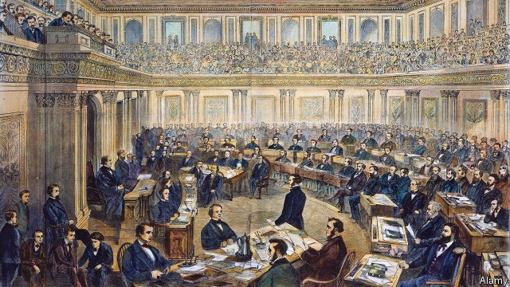
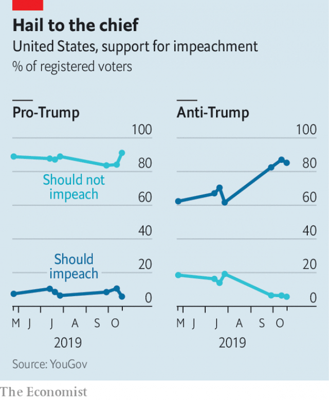

###### Trying times

# What an impeachment trial of Donald Trump might look like 

 

> print-edition iconPrint edition | United States | Oct 24th 2019 

ALEXANDER HAMILTON warned in 1788 that impeachment risks “agitat[ing] the passions of the whole community” and spurring “pre-existing factions” to “animosities, partialities, influence and interest”. The process, he wrote, carries the “greatest danger” that “real demonstrations of innocence or guilt” will amount to little in the face of raw political calculations. But the constitution carves a path around the maelstrom, Hamilton insisted: the United States Senate will have the “sole power to try all impeachments” sent its way by the House of Representatives. Senators, “unawed and uninfluenced” by the passions of the day, are “sufficiently dignified” to weigh whether an impeached official should be thrown from office. 

On October 22nd America’s top diplomat in Ukraine, William Taylor, testified to House investigators that President Donald Trump threatened to withhold $391m in military aid unless Volodymr Zelensky, Ukraine’s president, opened an investigation into the son of Joe Biden, one of Mr Trump’s potential rivals in next year’s election. It was the clearest and most detailed account to date—from a public servant whose career spans five decades and nine administrations—of Mr Trump leaning on a foreign leader to help his re-election effort. Mr Taylor’s testimony makes impeachment in the House likelier. It remains to be seen whether members of Congress’s upper chamber will put party aside and live up to Hamilton’s billing. 

Although it takes only a majority vote to impeach in the House, conviction requires the assent of two-thirds of the senators present—67 if 100 attend. At least 20 Republicans, along with all 47 Democrats, would have to find Mr Trump guilty. That seems unlikely. Only Mitt Romney of Utah has even hinted he might defect. No American president has yet been removed—though in 1868 Andrew Johnson escaped by just one vote (his trial is pictured). 

A Senate trial could nonetheless prove a crucible at a fraught time. Mr Trump’s questionable foreign-policy moves—particularly his abrupt decision to withdraw American forces from northern Syria—have provoked condemnation from even stalwart supporters like Senator Lindsey Graham and Mitch McConnell, the Senate majority leader. 

Keeping the Senate proceedings “civil and orderly”—a task that the constitution assigns to the chief justice—may be a struggle, says Laurence Tribe, a Harvard law professor and co-author of “To End a Presidency”. The previous chief justice, William Rehnquist, said of his role in the impeachment trial of Bill Clinton in 1999 that “I did nothing in particular, and I did it very well.” John Roberts, the chief today, faces a more partisan environment but, Mr Tribe says, will seek to emulate his predecessor. 

The details of removal trials are “all entirely fluid in theory,” says Frank Bowman, author of the book “High Crimes and Misdemeanours”, but their contours are clear. Senate rules, last updated in 1986, require the body to summon the president after the House impeaches him. Select members of the House of Representatives—dubbed “House managers”—prosecute their case. The president presents a defence. Senators may not question anyone directly. They are “commanded” at the outset of the trial by the sergeant-at-arms to “keep silence, on pain of imprisonment”. But if they have questions—senators had more than 150 during Mr Clinton’s trial—they can jot them down and pass them to the chief justice, who will read them aloud. After closed-door deliberations, cameras roll again for the final public vote on each impeachment article. 

An impeachment trial has several trappings of a court trial: lawyers, evidence, jurors, verdict. But the proceedings and judgment are fundamentally political. A removed official has no appeal. And there are no set rules of evidence, no due-process requirement and of course no gag rule for jurors—senators must stay mum inside the chamber but can talk freely to the press. 

Michael Gerhardt, a law professor at the University of North Carolina who testified at the Clinton impeachment, says that Republicans could change the rules by majority vote. Democrats could try to filibuster any change, but the filibuster could itself be nixed by a simple majority. Yet there may be little need for Mr McConnell to resort to that. Instead he could choose to limit the witnesses or evidence Democrats could introduce; allow Mr Trump “to assert privilege to prevent anything from being disclosed that the president does not wish to be disclosed”; or “impose a tougher burden of proof”—like the criminal standard of “beyond a reasonable doubt”—to tip the balance in Mr Trump’s favour. 

 

Mr McConnell has time to consider his options while the House, led by Speaker Nancy Pelosi, continues its run-up to impeachment. A growing number of Americans think that Congress is right to impeach Mr Trump. But only a small number of Republicans have changed their minds. Instead, more voters who already disapproved of Mr Trump have come round to the idea (see chart). 

As long as Mr Trump’s fans remain loyal, Mr Bowman muses that Republicans could turn a trial into a “circus” airing “every crazy conspiracy theory”, including “unfounded allegations about Mr Biden and his son”. In a bad sign, on October 23rd two dozen Republican congressmen led by Steve Scalise, the minority whip from Louisiana, stormed the House proceedings. But if the president’s popularity should start to decline rapidly, Mr McConnell could instead shorten the trial to limit the damage and shore up senators facing re-election next year in swing states. ■ 

