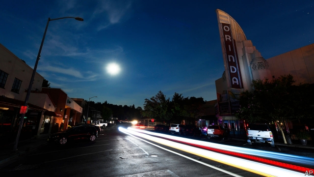

###### Power struggle

# Why California can’t quit PG&E 

 

> print-edition iconPrint edition | United States | Oct 26th 2019 

SOME STUDENTS might celebrate a cancelled class. Not Mekhala Hoskote, a medical student at the University of California, Berkeley, which cancelled classes on October 9th because of a lack of electricity. She still had exams to prepare for. “I considered going back to my parents’,” she says. “But it wasn’t a guarantee that they would have power too.” 

On October 23rd the Pacific Gas and Electric Company (PG&E) cut power to over 180,000 homes and businesses in northern California. That came just two weeks after a blackout that left 2m people, including Ms Hoskote, without power. The firm, which in January declared bankruptcy because of $30bn in liabilities from last year’s wildfires, said it had to cut power to prevent new fires from breaking out. PG&E has a monopoly over its coverage area, and Californians are livid. But there may not be much they can do. 

PG&E is the largest utility company in the state, serving 16m people across a 70,000-square-mile service area in northern and central California. Two other investor-owned utilities—Southern California Edison and San Diego Gas and Electric—distribute power to the majority of customers through the rest of the state, both serving southern California. Subject to state regulation, each operates in effect as a regional monopoly in its coverage area. 

Historically, the rationale for the monopoly status of utilities across America has been that large capital and infrastructure investments are needed. Billions are spent to set up transformers, poles and transmission and distribution lines. Companies that could scale up to large areas could also provide power at lowest cost. Much of the south-east, north-west and the west outside California have vertically integrated markets, where utilities manage the entire flow of electricity to consumers. In California generation, transmission and retail services are split up. Generation is competitive, but distribution is not. 

Some cities in the Golden State have tried to break up monopolies by taking over power distribution themselves, says Charles Kolstad of Stanford University. Sacramento, Palo Alto and Los Angeles all have municipal utilities. In September San Francisco offered to buy PG&E’s infrastructure for $2.5bn. San Jose’s mayor has also said he is exploring a similar proposal. 

But PG&E rejected both bids, despite its shaky finances. Because it is costly to provide electricity to remote areas, “the cities subsidise the costs of providing electricity to rural areas”, says Severin Borenstein of the University of California, Berkeley. The more cities PG&E loses, the less easy it is to cross-subsidise other places. The firm has tried to frustrate municipal power plans for most of a century, ever since Sacramento created its utility in 1923. It put up $46m for a statewide ballot initiative in 2010, which failed, to limit the ability of local governments to manage their own energy. 

But even if municipalities managed to buy out PG&E’s infrastructure, they might get into the same trouble themselves anyway, adds Mr Borenstein. Climate change has drastically affected utilities’ business models. Under Californian regulations, utilities are liable for damage caused by wildfires regardless of the extent of their negligence, as long as their equipment is involved in sparking blazes. 

PG&E has a plan to “harden” its grid, which includes installing fire-resistant poles, trimming trees and putting infrastructure underground. But completely stopping fires will be difficult. In January PG&E said it would cost from $75bn to $150bn, or 2.5-5% of California’s annual GDP, to fully comply with a judge’s order to remove trees that could fall into its power lines. Sadly for Berkeley students, shutoffs are a more cost-effective way to avoid future liabilities. ■ 

